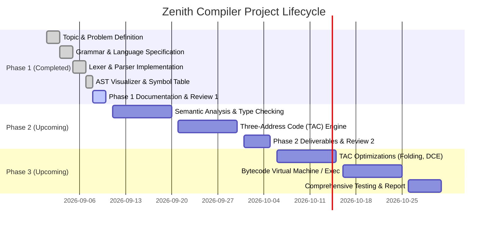

# COMPILER DESIGN LABORATORY PROJECT
## PHASE 1: PROBLEM DEFINITION AND SYSTEM DESIGN REPORT

---

# **ZENITH**
### *A Strongly-Typed Procedural Language Compiler with AST Visualization, Scoped Symbol Table, and Intermediate Three-Address Code (TAC) Generation*

**Course:** Compiler Design Laboratory  
**Phase:** Phase 1 – Problem Definition, Language Specification & System Design  
**Academic Requirement:** Individual Project  
**Repository / Working Directory:** `/zenith-compiler`  

---

## **Abstract**

This project presents the design and implementation of **Zenith**, a strongly-typed, procedural programming language and its multi-pass compiler system. The project applies foundational compiler theory to address a common pedagogical and architectural challenge: the opacity of modern production compilers and the lack of strict compile-time safety in lightweight scripting languages. The Zenith compiler pipeline encompasses all canonical stages of language processing: lexical analysis using deterministic finite-state pattern matching, syntax analysis using an LL(1) recursive descent parser with precedence climbing, syntax-directed construction of an Abstract Syntax Tree (AST), hierarchical scoped symbol table management, static type checking, machine-independent intermediate code generation producing Three-Address Code (TAC), optimization passes (constant folding, algebraic simplification, and dead code elimination), and execution via a stack-based virtual machine. 

In **Phase 1**, we establish the complete problem definition, formal language grammar in Extended Backus-Naur Form (EBNF), detailed system architecture, and an initial working prototype consisting of the lexical analyzer, recursive descent parser, AST tree visualizer, and scoped symbol table manager. The prototype successfully processes source code files, validates syntax, handles multi-character operators and nested scopes, and outputs structured visual syntax trees and symbol tables with comprehensive error diagnostics.

---

## **Chapter 1: Introduction**

### 1.1 Background
Compilers are the foundation of computer science and software engineering, acting as the translation bridge between human-readable high-level abstractions and machine-executable instructions. The study of compiler design integrates formal language theory, automata theory, data structures, graph algorithms, and computer architecture. A complete compiler consists of:
1. **Front-End (Analysis Phase):** Lexical analysis, syntax analysis, and semantic analysis.
2. **Middle-End (Intermediate Representation & Optimization):** Intermediate code generation (e.g., Three-Address Code) and machine-independent optimizations.
3. **Back-End (Synthesis Phase):** Target code generation, register allocation, instruction scheduling, and execution.

### 1.2 Motivation
In educational curricula and software development, students and engineers frequently interact with two extremes:
- **Dynamically typed scripting languages** (e.g., standard Python, JavaScript) provide rapid development velocity but defer type errors and scoping bugs to runtime, causing catastrophic failures in critical systems.
- **Monolithic industrial compilers** (e.g., GCC, Clang/LLVM) provide high performance and strict safety but operate as massive, opaque black boxes with millions of lines of code. It is virtually impossible to inspect how an individual token flows into a parse tree, how a symbol table resolves nested lexical closures, or how high-level expressions decompose into intermediate quadruples.

There is a distinct need for a clean, fully-featured procedural language whose compiler exposes every phase of the translation pipeline transparently, featuring visual diagnostics and strict compile-time guarantees.

### 1.3 Problem Area
The problem area centers on the design and implementation of an end-to-end language processing system that enforces:
- Explicit static typing (`int`, `float`, `bool`, `string`, `void`).
- Compile-time immutability distinction (`let` mutable declarations vs. `const` immutable declarations).
- Lexical scoping with nested activation records.
- Transparent intermediate code representation using Three-Address Code (TAC).
- Visual feedback at every stage for debugging, validation, and educational demonstrations.

---

## **Chapter 2: Problem Statement**

### 2.1 Formal Problem Definition
To design, implement, and validate a modular, multi-pass compiler for a strongly-typed procedural language named **Zenith**, capable of:
1. Lexically scanning source text into discrete typed tokens while maintaining line and column coordinate metadata.
2. Parsing the token stream using an LL(1) recursive descent parser governed by a deterministic, unambiguous Context-Free Grammar (CFG).
3. Constructing a strongly-typed Abstract Syntax Tree (AST) that eliminates redundant syntactic markers while preserving semantic precedence.
4. Managing hierarchical lexical scopes using a chained scoped symbol table to prevent redeclarations and track variable lifecycles.
5. In subsequent phases: Enforcing static semantic constraints (type checking, immutability rules), translating the AST into linear Three-Address Code (TAC), performing control-flow and data-flow optimizations, and executing the resulting instructions via a stack-based virtual machine.

### 2.2 Shortcomings of Existing Approaches
| System Type | Representative Examples | Limitations Addressed by Zenith |
| :--- | :--- | :--- |
| **Toy Interpreters / Calculators** | Lab tutorial expression evaluators | Evaluate syntax trees directly without intermediate representation; lack symbol tables, scopes, functions, and optimizations. |
| **Dynamically Typed Interpreters** | Python, Ruby | No compile-time type verification; runtime type crashes; obscure memory model. |
| **Black-Box Compilers** | GCC, Clang | Complex toolchains; intermediate representations (GIMPLE, LLVM IR) are difficult to inspect and trace back to high-level language structures for learning. |

### 2.3 Proposed Solution
Zenith solves these limitations by implementing a transparent, decoupled multi-pass compiler architecture. Every compilation stage produces human-inspectable artifacts:
- Stage 1 $\to$ Formatted Token Table with line/column coordinates.
- Stage 2 $\to$ Hierarchical ASCII Tree representation of the AST.
- Stage 3 $\to$ Scoped Symbol Table displaying active identifiers, types, categories, and scope levels.
- Stage 4 & 5 (Phases 2 & 3) $\to$ Line-by-line Three-Address Code (TAC) listing and optimized TAC output.

---

## **Chapter 3: Objectives and Scope**

### 3.1 Primary Objectives
- Formulate a clean, unambiguous Context-Free Grammar (CFG) for the Zenith language.
- Implement an efficient, hand-crafted Lexical Analyzer (Lexer) with full token classification and error handling.
- Construct an LL(1) Recursive Descent Parser utilizing precedence climbing to eliminate shift-reduce and reduce-reduce conflicts.
- Implement an explicit Abstract Syntax Tree (AST) hierarchy with visitor/printer capabilities.
- Develop a Scoped Symbol Table supporting block scopes, function scopes, and identifier resolution.
- Provide a command-line interface (CLI) and interactive REPL for real-time inspection.

### 3.2 Phased Milestone Roadmap



### 3.3 Scope of the Project
- **In-Scope:**
  - Primitive types: `int`, `float`, `bool`, `string`, `void`.
  - Mutable (`let`) and Immutable (`const`) variable bindings.
  - Comprehensive operators: Arithmetic (`+`, `-`, `*`, `/`, `%`), Relational (`==`, `!=`, `<`, `<=`, `>`, `>=`), Logical (`&&`, `||`, `!`).
  - Structured control flow: `if-elif-else`, `while`, `for`.
  - Function declarations, typed parameter lists, return statements, and function calls.
  - Scoped symbol resolution with parent chaining.
  - Three-Address Code intermediate representation.
  - Machine-independent optimizations (constant folding, dead code removal).
  - Virtual machine / interpreter runtime for execution.
- **Out-of-Scope (Design Non-Goals):**
  - Complex object-oriented inheritance and polymorphic virtual method tables.
  - Dynamic memory garbage collection algorithms (focus is on structured lexical memory).
  - Native x86-64/ARM machine assembly emission (handled via TAC and bytecode VM).

---

## **Chapter 4: Literature Survey and Background Study**

### 4.1 Lexical Analysis (Scanning)
Lexical analysis is the first phase of a compiler. Its fundamental task is to read the input stream of characters and group them into meaningful sequences called **lexemes**, producing a sequence of **tokens** conforming to regular expressions:
$$\text{Source Characters} \xrightarrow{\text{Lexer}} \langle \text{Token Type}, \text{Attribute Value}, \text{Line}, \text{Col} \rangle$$
Theoretical tools like Lex and Flex generate Deterministic Finite Automata (DFA) based on Thompson's Construction and subset construction. In Zenith, we employ a custom, state-preserving scanner designed in pure Python. This provides zero-overhead dependency integration, fine-grained position tracking, and user-friendly error messages that pinpoint line and column numbers.

### 4.2 Parsing Techniques (Syntax Analysis)
Syntax analysis verifies that the token sequence conforms to the syntactic rules of a Context-Free Grammar (CFG) $G = (V, \Sigma, R, S)$, where $V$ is non-terminals, $\Sigma$ is terminals, $R$ is production rules, and $S$ is the start symbol.

Compiler construction commonly uses two parsing paradigms:
1. **Bottom-Up Parsing (LR, LALR, SLR):** Used in Yacc and Bison. Operates by shift-reduce actions using a parser state stack. While powerful, shift-reduce tables are difficult to debug and trace during academic demonstrations.
2. **Top-Down Parsing (LL(k), Recursive Descent):** The parser constructs the parse tree from root to leaves. Each non-terminal corresponds to a programming function. We implement a **Recursive Descent Parser with Operator Precedence Climbing**. This approach directly mirrors the formal grammar, simplifies error synchronization, and allows direct step-through debugging during viva reviews.

### 4.3 Abstract Syntax Tree (AST) vs. Concrete Parse Tree
A Concrete Parse Tree (CST) contains redundant nodes representing punctuation, grouping parentheses, and intermediate non-terminals. An **Abstract Syntax Tree (AST)** retains only structural and semantic information:
```
Concrete Parse Tree:                 Abstract Syntax Tree:
      E                                    BinaryExpr (+)
    / | \                                  /            \
   E  +  E                           Literal(10)     Literal(20)
   |     |
  10    20
```
Zenith uses a strongly-typed, object-oriented AST representation where each node is a distinct dataclass (`Program`, `VarDecl`, `IfStmt`, `BinaryExpr`, etc.).

### 4.4 Symbol Table Architecture
A symbol table is a compile-time dictionary used by the compiler to record identifier attributes (type, storage location, scope level, line of declaration). In languages with nested lexical blocks (such as Algol, C, and Zenith), scoping is modeled as a tree of symbol tables with parent links:
- When entering a `{ ... }` block or function, a new child `Scope` is created.
- Symbol insertion (`insert`) checks the current local scope to detect invalid duplicate declarations in $O(1)$ time.
- Symbol lookup (`lookup`) inspects the local scope first; if not found, it traverses parent pointers up to the global scope ($O(k)$ where $k$ is scope nesting depth).
- Upon exiting a block, the scope stack is popped back to the parent.

### 4.5 Intermediate Representations (IR)
Intermediate representations decouple the front-end language syntax from the back-end execution architecture. Three-Address Code (TAC) is a linearized representation where each instruction has at most one operator and at most three address fields:
$$x = y \text{ op } z$$
Linear TAC simplifies data-flow analysis, basic block partitioning, and optimization algorithms.

---

## **Chapter 5: System Design and Architecture**

### 5.1 Architectural Block Diagram

```
+-----------------------------------------------------------------------------------+
|                              ZENITH COMPILER PIPELINE                             |
+-----------------------------------------------------------------------------------+
|                                                                                   |
|   +-------------------+      Token Stream      +------------------------------+   |
|   |  Lexical Analyzer | ---------------------> |   Recursive Descent Parser   |   |
|   |    (lexer.py)     |                        |         (parser.py)          |   |
|   +-------------------+                        +------------------------------+   |
|             ^                                                 |                   |
|             | Source Text (.zen)                              | Generates AST     |
|             |                                                 v                   |
|   +-------------------+                        +------------------------------+   |
|   | Token Definitions |                        | Abstract Syntax Tree (AST)   |   |
|   |   (tokens.py)     |                        |       (ast_nodes.py)         |   |
|   +-------------------+                        +------------------------------+   |
|                                                               |                   |
|                                                               v                   |
|                                                +------------------------------+   |
|                                                | Scoped Symbol Table Builder  |   |
|                                                |      (symbol_table.py)       |   |
|                                                +------------------------------+   |
|                                                               |                   |
|                                                               v                   |
|                                                +------------------------------+   |
|                                                | ASCII Visualizer / Inspector |   |
|                                                |        (printer.py)          |   |
|                                                +------------------------------+   |
|                                                                                   |
+-----------------------------------------------------------------------------------+
|                     FUTURE PHASES (Phase 2 & Phase 3 Roadmap)                     |
|                                                                                   |
|   +-----------------------+      +--------------------+      +----------------+   |
|   | Semantic Type Checker | ---> |   TAC Generator    | ---> | TAC Optimizer  |   |
|   +-----------------------+      +--------------------+      +----------------+   |
|                                                                      |            |
|                                                                      v            |
|                                                              +----------------+   |
|                                                              |  Bytecode VM   |   |
|                                                              +----------------+   |
+-----------------------------------------------------------------------------------+
```

### 5.2 Module Descriptions (Phase 1 Prototype)
1. **`src/tokens.py`**: Declares `TokenType` enum (34 distinct token categories) and the immutable `Token` dataclass with `lexeme`, `value`, `line`, and `column`.
2. **`src/lexer.py`**: Converts source character strings into a sequence of tokens. Implements lookahead (`peek`, `peek(1)`), line/column tracking, comment filtering (`//` and `/* */`), and lexical error logging.
3. **`src/ast_nodes.py`**: Object-oriented AST node hierarchy defining statements (`VarDecl`, `Assignment`, `IfStmt`, `WhileStmt`, `ForStmt`, `FnDecl`, `ReturnStmt`, `PrintStmt`) and expressions (`BinaryExpr`, `UnaryExpr`, `LiteralExpr`, `IdentifierExpr`, `CallExpr`).
4. **`src/parser.py`**: Hand-written recursive descent parser enforcing EBNF grammar rules. Employs operator precedence climbing for arithmetic/logical expressions and panic-mode synchronization for error recovery.
5. **`src/symbol_table.py`**: Manages lexical environments, detects duplicate identifiers within identical scopes, validates identifier presence, and maintains a complete historical record of all program scopes.
6. **`src/printer.py`**: Generates visual representations of tokens, ASCII tree structures of the AST, and aligned symbol tables.
7. **`src/main.py`**: Driver CLI providing arguments (`--tokens`, `--ast`, `--symtab`, `--all`) and an interactive REPL shell.

### 5.3 Error Detection and Recovery Strategy
- **Lexical Errors:** Encountering illegal characters (e.g. `@`, `$`, unterminated strings) creates an `ILLEGAL` token and appends a `LexerError` with exact coordinate information without crashing the process.
- **Syntax Errors:** When an expected terminal is not found, a `ParserError` is recorded, and the parser activates **panic-mode recovery** (`_synchronize`). It discards tokens until a statement boundary (e.g. `;` or keywords like `let`, `if`, `while`, `fn`) is reached, allowing the parser to discover multiple syntax errors in a single run.

---

## **Chapter 6: Proposed Methodology**

The development of Zenith follows a structured, multi-pass compiler engineering methodology:

```
[Requirement & Grammar Formulation]
                │
                ▼
  [Lexer & Scanner Engineering]
                │
                ▼
  [Recursive Descent Parser & AST]  ◄── Phase 1 Scope (Completed)
                │
                ▼
  [Symbol Table & Scope Resolution]
                │
                ▼
[Semantic Analysis & Type Checking] ◄── Phase 2 Target
                │
                ▼
   [Three-Address Code Generation]
                │
                ▼
  [Machine-Independent Optimization] ◄── Phase 3 Target
                │
                ▼
    [Virtual Machine Execution]
```

---

## **Chapter 7: Compiler Design Concepts Used**

| Compiler Concept | Theoretical Definition | Concrete Zenith Implementation |
| :--- | :--- | :--- |
| **Regular Expressions & DFAs** | Deterministic state transitions over an alphabet | Lexer scanning loop recognizing keywords, identifiers, integer/float literals, strings, and operators. |
| **Context-Free Grammar (CFG)** | 4-tuple generating formal language strings | Unambiguous EBNF grammar defined for statements, expressions, blocks, and declarations. |
| **Recursive Descent Parsing** | Top-down parsing using mutually recursive functions | Parser methods: `_statement()`, `_var_decl()`, `_if_stmt()`, `_expression()`, etc. |
| **Operator Precedence Climbing** | Parsing expressions according to operator binding power | Precedence hierarchy: Or $\to$ And $\to$ Equality $\to$ Relational $\to$ Additive $\to$ Multiplicative $\to$ Unary. |
| **Abstract Syntax Tree (AST)** | Structural syntax tree free of concrete syntax punctuation | Hierarchical node classes in `ast_nodes.py` printed via `ASTPrinter`. |
| **Scoped Symbol Table** | Tree-structured dictionary tracking identifier bindings | `Scope` class with `parent` links; `SymbolTable` tracking levels and duplicate errors. |
| **Panic-Mode Error Recovery** | Skipping tokens until a synchronizing token is matched | `_synchronize()` method in `parser.py` seeking statement boundaries. |

---

## **Chapter 8: Technology Stack & Language Specification**

### 8.1 Technology Stack
- **Implementation Language:** Python 3.9+ (Standard Library only; zero external dependencies for maximum portability and ease of demonstration).
- **Core Modules Used:** `dataclasses` (clean AST representation), `enum` (strongly-typed token classification), `typing` (type safety), `sys` & `os` (CLI runtime), `argparse` (CLI options).
- **Development & Testing Tools:** Terminal CLI, Git for version control, Python unittest framework.

### 8.2 Formal Context-Free Grammar (EBNF)

```ebnf
program         ::= { statement }

statement       ::= var_decl
                  | assignment
                  | if_stmt
                  | while_stmt
                  | for_stmt
                  | fn_decl
                  | return_stmt
                  | print_stmt
                  | expr_stmt
                  | block

var_decl        ::= ( "let" | "const" ) IDENTIFIER ":" type [ "=" expression ] ";"
type            ::= "int" | "float" | "bool" | "string" | "void"

assignment      ::= IDENTIFIER "=" expression ";"
expr_stmt       ::= expression ";"
block           ::= "{" { statement } "}"

if_stmt         ::= "if" "(" expression ")" block { "elif" "(" expression ")" block } [ "else" block ]
while_stmt      ::= "while" "(" expression ")" block
for_stmt        ::= "for" "(" [ var_decl ] [ expression ] ";" [ assignment ] ")" block

fn_decl         ::= "fn" IDENTIFIER "(" [ param_list ] ")" [ "->" type ] block
param_list      ::= param { "," param }
param           ::= IDENTIFIER ":" type

return_stmt     ::= "return" [ expression ] ";"
print_stmt      ::= "print" "(" [ expression { "," expression } ] ")" ";"

expression      ::= logical_or
logical_or      ::= logical_and { "||" logical_and }
logical_and     ::= equality { "&&" equality }
equality        ::= relational { ( "==" | "!=" ) relational }
relational      ::= additive { ( "<" | "<=" | ">" | ">=" ) additive }
additive        ::= multiplicative { ( "+" | "-" ) multiplicative }
multiplicative  ::= unary { ( "*" | "/" | "%" ) unary }
unary           ::= ( "-" | "!" ) unary | primary

primary         ::= INT_LIT
                  | FLOAT_LIT
                  | STRING_LIT
                  | "true"
                  | "false"
                  | IDENTIFIER [ "(" [ arg_list ] ")" ]
                  | "(" expression ")"

arg_list        ::= expression { "," expression }
```

### 8.3 Operator Precedence and Associativity Table

| Precedence Level | Operators | Description | Associativity |
| :---: | :---: | :---: | :---: |
| 1 (Lowest) | `\|\|` | Logical OR | Left-to-Right |
| 2 | `&&` | Logical AND | Left-to-Right |
| 3 | `==`, `!=` | Equality & Inequality | Left-to-Right |
| 4 | `<`, `<=`, `>`, `>=` | Relational Comparisons | Left-to-Right |
| 5 | `+`, `-` | Addition, Subtraction | Left-to-Right |
| 6 | `*`, `/`, `%` | Multiplication, Division, Modulo | Left-to-Right |
| 7 (Highest) | `-` (unary), `!` | Negation, Logical NOT | Right-to-Left |

---

## **Chapter 9: Initial Prototype Implementation & Demonstration**

The Phase 1 prototype is fully functional and located in `/src`. It includes four comprehensive test programs located in `/tests`:

### 9.1 Test Program 1: Basic Math & Variable Declarations (`tests/01_basic_math.zen`)
Demonstrates lexical analysis, tokenization of `let`/`const`, float arithmetic, operator precedence, and relational logic.

**Visual AST Output Snippet:**
```
└── Program [L2:C1]
    ├── VarDecl: const PI: float [L2:C1]
    │   └── Literal: 3.14159 (float) [L2:C17]
    ├── VarDecl: let radius: float [L3:C1]
    │   └── Literal: 5.0 (float) [L3:C19]
    ├── VarDecl: let area: float [L4:C1]
    │   └── BinaryExpr: (*) [L4:C25]
    │       ├── BinaryExpr: (*) [L4:C20]
    │       │   ├── Identifier: PI [L4:C17]
    │       │   └── Identifier: radius [L4:C22]
    │       └── Identifier: radius [L4:C31]
    ...
```

### 9.2 Test Program 2: Control Flow & Scopes (`tests/02_control_flow.zen`)
Demonstrates multi-branch `if-elif-else`, condition parsing, `while` loop, `for` loop, and nested block scopes.

### 9.3 Test Program 3: Functions & Call Expressions (`tests/03_functions.zen`)
Demonstrates function declaration parsing, typed parameter lists, return statements, function invocations, and function-level symbol tables.

### 9.4 Test Program 4: Error Handling & Synchronization (`tests/04_syntax_error.zen`)
Demonstrates the parser recovering from missing type annotations and missing parentheses, reporting accurate line and column numbers.

---

## **Chapter 10: Conclusion and Next Steps**

### 10.1 Phase 1 Summary
Phase 1 has successfully accomplished all foundational objectives mandated by the Compiler Design Laboratory Project manual:
- Problem definition, objectives, and scope established.
- Formal EBNF grammar and token specifications formulated.
- Working prototype developed: Lexer, Recursive Descent Parser, AST builder, Scoped Symbol Table, and AST visualizer.
- Validated against test cases covering arithmetic, control flow, functions, and error recovery.

### 10.2 Phase 2 Plan (Upcoming)
1. **Semantic Analysis:** Static type checking, type coercion rules, validation of return statement types against function signatures.
2. **Immutability Enforcement:** Detecting and reporting illegal reassignments to `const` variables.
3. **Three-Address Code (TAC) Generation:** Translating AST expressions and control flow into quadruples with temporary variables (`t0`, `t1`, ...) and jump labels (`L1`, `L2`, ...).

---

## **References**
1. Aho, A. V., Lam, M. S., Sethi, R., & Ullman, J. D. (2006). *Compilers: Principles, Techniques, and Tools* (2nd ed.). Addison-Wesley (The Dragon Book).
2. Cooper, K. D., & Torczon, L. (2011). *Engineering a Compiler* (2nd ed.). Morgan Kaufmann.
3. Nystrom, R. (2021). *Crafting Interpreters*. Genever Bench.
4. Louden, K. C. (1997). *Compiler Construction: Principles and Practice*. PWS Publishing Company.
5. Grune, D., van Reeuwijk, K., Bal, H. E., Jacobs, C. J., & Langendoen, K. (2012). *Modern Compiler Design*. Springer.
